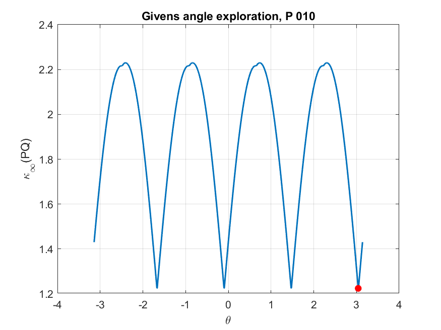
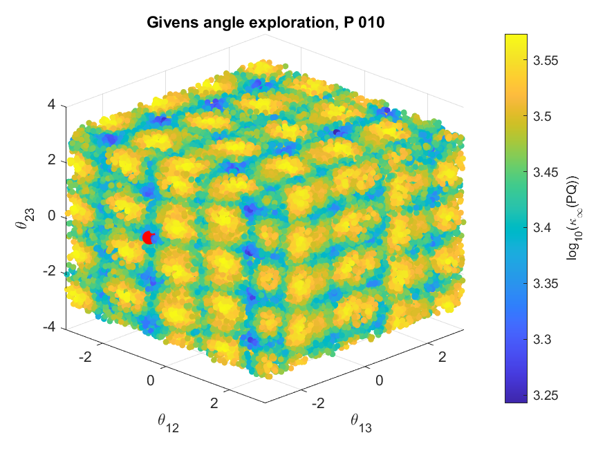

# Objective

The objective of this document is to develop ideas for algorithms related to optimization problems. The first algorithm considered is a projected gradient and subgradient method for optimization over the space of orthogonal matrices.

# Optimization problem involving orthogonal matrices

The admissible set is defined as

$$
\mathcal{O}(K)
=
\left\{
Q\in\mathbb{R}^{K\times K}
:
Q'Q=QQ'=I
\right\}.
$$

To formulate an optimization problem over the set of orthogonal matrices, a generic factorization of the reduced-form covariance matrix can then be written as

$$
\Sigma_e
=
B_0^{-1}B_0^{-1'}.
=
PQQ'P'
$$

where  $P$ is the Cholesky factor associated with the benchmark recursive identification, and $Q\in\mathcal{O}(K)$ is an orthogonal rotation matrix.

Therefore, orthogonal rotations generate alternative structural decompositions that preserve the reduced-form variance-covariance matrix. This provides the basis for defining an optimization problem over $Q$ to select a structural decomposition according to a minimum condition number of $B_0^{-1}=(PQ)$ criterion.

The optimization problem can be formulated as follows: 

$$
Q^{*}= \text{argmin}_{Q\in\mathcal{O}(K)} \kappa_{p}(PQ),
$${#eq-optimizationProblem}

where $p\in\{1,\infty\}$. The case $p=2$ is excluded because, under the Euclidean norm, $\kappa_2(PQ)=\kappa_2(P)$; hence, the objective function does not depend on $Q$.

# Algorithm Givens Rotation Matrices...

## Rotation Matrices

The special orthogonal group is defined as

$$
SO(K)
=
\left\{
Q\in\mathbb{R}^{K\times K}
:
Q'Q=I,\;
\det(Q)=1
\right\}.
$$

Using Givens rotations, an element of $SO(K)$ can be parameterized as

$$
Q(\boldsymbol{\theta})
=
\prod_{i<j} G_{ij}(\theta_{ij}),
\qquad
Q(\boldsymbol{\theta})\in SO(K),
$$

where

$$
\boldsymbol{\theta}
=
\{\theta_{ij}\}_{1\le i<j\le K}.
$$

The total number of rotation angles is

$$
\frac{K(K-1)}{2}.
$$

Equivalently,

$$
SO(K)
=
\left\{
\prod_{i<j} G_{ij}(\theta_{ij})
:
\theta_{ij}\in\mathbb{R}
\right\},
$$

for a fixed ordering of the Givens rotations.

## Algorithm with Rotation Matrices

The purpose of using Givens rotation matrices is to replace the search over
the full space of orthogonal matrices with a search over a finite vector of
rotation angles. Instead of optimizing directly over the entries of $Q$, the
algorithm optimizes over

$$
\boldsymbol{\theta}
\in
\mathbb{R}^{K(K-1)/2},
$$

and then constructs the orthogonal matrix as $Q(\boldsymbol{\theta})$. This
parameterization reduces the dimensionality of the numerical search and
guarantees that every candidate matrix generated by the algorithm is
orthogonal.

The numerical procedure used to approximate the solution of
@eq-optimizationProblem is as follows:

1. Define the number of Givens angles:

   $$
   n_\theta = \frac{K(K-1)}{2}.
   $$

2. Generate an initial collection of $N$ candidate angle vectors,

   $$
   \Theta
   =
   \left\{
   \boldsymbol{\theta}^{(1)},\ldots,
   \boldsymbol{\theta}^{(N)}
   \right\},
   \qquad
   \boldsymbol{\theta}^{(s)}\in[-\pi,\pi]^{n_\theta}.
   $$

   For $K=2$, this can be done with a one-dimensional grid over
   $[-\pi,\pi]$. For higher dimensions, a full Cartesian grid becomes
   computationally infeasible, because the number of grid points grows
   exponentially with $n_\theta$. Therefore, the algorithm uses a
   space-filling design based on *Latin Hypercube Sampling* to explore the
   angle space more evenly than purely independent random draws.

3. For each candidate vector $\boldsymbol{\theta}^{(s)}$, construct the
   corresponding Givens rotation matrix:

   $$
   Q^{(s)} = Q(\boldsymbol{\theta}^{(s)}).
   $$

4. Evaluate the objective function for each candidate:

   $$
   \kappa_p\left(PQ(\boldsymbol{\theta}^{(s)})\right).
   $$

   This produces $N$ candidate condition numbers.

5. Sort the candidates according to their objective values and select the
   best $M$ angle vectors, that is, the vectors associated with the smallest
   values of

   $$
   \kappa_p\left(PQ(\boldsymbol{\theta})\right).
   $$

6. Starting from each of these $M$ promising angle vectors, perform a local
   refinement step. In the current implementation, this refinement is carried
   out with a constrained nonlinear optimizer over the angle vector
   $\boldsymbol{\theta}$, with bounds

   $$
   -\pi \leq \theta_\ell \leq \pi,
   \qquad
   \ell=1,\ldots,n_\theta.
   $$

7. Compare the refined candidates with the best values obtained during the
   initial exploration. The final numerical solution is the matrix

   $$
   Q^* = Q(\boldsymbol{\theta}^*)
   $$

   associated with the smallest condition number found across both the
   initial exploration and the local refinement steps.

This procedure should be interpreted as a multistart numerical search rather
than a guarantee of global optimality. The objective function is non-convex
and non-smooth under the $\ell_1$ and $\ell_\infty$ induced norms, so different
initial angle vectors may lead to different local solutions.

::: {.callout-warning}
With this algorithm, we are only exploring the space of special orthogonal matrices, $SO(K)$. However, matrices with determinant $-1$ are only reflections of $Q$, so it is not necessary to explore them separately.
:::

## Special Cases $K = 2,3,4$

For low-dimensional cases, particularly $K=2,3,4$, the numerical solutions
often exhibit additional structure. In these cases, the matrices $Q^*$ found
by the algorithm can frequently be grouped into families of equivalent or
nearly equivalent rotations. Within each family, different solutions appear to
be related by canonical angular shifts, such as

$$
\pm \pi,\qquad
\pm\frac{\pi}{2},\qquad
\pm\frac{2\pi}{3}.
$$

This suggests that, in small dimensions, the optimizer may recover several
representations of the same underlying rotation pattern. These patterns are
easier to identify when the Givens angles are compared modulo canonical angle
increments, or when the resulting matrices are compared up to signed
permutations.

::: {layout-ncol=2}

:::

For higher-dimensional cases, especially when $K>4$, the same type of simple
structure is not as clearly observed numerically. The number of Givens angles
increases rapidly with $K$, and the optimization landscape becomes more
complex. As a result, different local solutions for the same matrix $P$ may no
longer be easily described by a small set of canonical angular rotations.

It is also important to account for symmetries induced by the objective
function. Under the induced infinity norm, column permutations and sign changes
of $Q^*$ preserve the row-wise absolute sums of $PQ^*$. Therefore, if $Q^*$ is
a solution, then

$$
Q^*S
$$

is also an equivalent solution for any signed permutation matrix $S$. A signed
permutation matrix combines a permutation of the columns with independent sign
changes. Since there are $K!$ possible permutations and $2^K$ possible sign
patterns, each solution generates an equivalence class containing

$$
2^K K!
$$

matrices with the same objective value. This symmetry should be considered
when counting or comparing numerical solutions, since apparently distinct
matrices may represent the same solution up to signed permutation.

