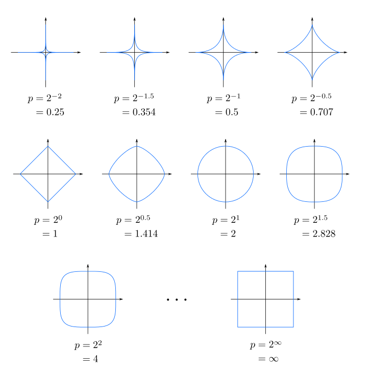

# Objective

The objective of this document is to develop ideas for algorithms related to optimization problems. The first algorithm considered is a projected gradient and subgradient method for optimization over the space of orthogonal matrices.

# Optimization problem involving orthogonal matrices

The admissible set is defined as

$$
\mathcal{O}(K)
=
\left\{
Q\in\mathbb{R}^{K\times K}
:
Q'Q=QQ'=I
\right\}.
$$

To formulate an optimization problem over the set of orthogonal matrices, a generic factorization of the reduced-form covariance matrix can then be written as

$$
\Sigma_e
=
B_0^{-1}B_0^{-1'}.
=
PQQ'P'
$$

where  $P$ is the Cholesky factor associated with the benchmark recursive identification, and $Q\in\mathcal{O}(K)$ is an orthogonal rotation matrix.

Therefore, orthogonal rotations generate alternative structural decompositions that preserve the reduced-form variance-covariance matrix. This provides the basis for defining an optimization problem over $Q$ to select a structural decomposition according to a minimum condition number of $B_0^{-1}=(PQ)$ criterion.

The optimization problem can be formulated as follows: 

$$
Q^{*}= \text{argmin}_{Q\in\mathcal{O}(K)} \kappa_{p}(PQ),
$${#eq-optimizationProblem}

where $p\in\{1,\infty\}$. The case $p=2$ is excluded because, under the Euclidean norm, $\kappa_2(PQ)=\kappa_2(P)$; hence, the objective function does not depend on $Q$.

# Algorithm Riemman Mainfolds...

## Gradient Descent

Gradient descent is based on the idea that, for a differentiable multivariable function $f(\mathbf{x})$, the function decreases most rapidly when we move from a point $\mathbf{a}$ in the direction opposite to its gradient, that is,

$$
-\nabla f(\mathbf{a}).
$$

Therefore, starting from a point $\mathbf{a}_n$, we update it as follows:

$$
\mathbf{a}_{n+1}
=
\mathbf{a}_n
-
\eta \nabla f(\mathbf{a}_n),
$$

where $\eta > 0$ is a sufficiently small step size, also called the learning rate. Subtracting $\eta \nabla f(\mathbf{a}_n)$ means that we are moving against the direction of steepest increase, and therefore toward a local minimum.

Using this idea, we begin with an initial guess $\mathbf{x}_0$ and construct a sequence of points

$$
\mathbf{x}_0, \mathbf{x}_1, \mathbf{x}_2, \ldots
$$

according to the rule

$$
\mathbf{x}_{n+1}
=
\mathbf{x}_n
-
\eta_n \nabla f(\mathbf{x}_n),
\qquad n \geq 0.
$$ {#eq-updatex}

If the learning rates $\eta_n$ are chosen properly, the function values decrease at each iteration:

$$
f(\mathbf{x}_0)
\geq
f(\mathbf{x}_1)
\geq
f(\mathbf{x}_2)
\geq
\cdots.
$$

Thus, the method generates a sequence of points that moves progressively closer to a local minimum. The step size does not have to remain constant; it may change from one iteration to the next.

## Euclidean Gradient

For this particular problem, it is convenient to apply a logarithmic transformation to the objective function $f(Q)$ as follows:
$$
\phi(Q)
=
\log \|PQ\|_p
+
\log \|Q'P^{-1}\|_p,
$$

since $(PQ)^{-1}=Q'P^{-1}$ and the logarithm preserves the minimizer.

By the chain rule, a Euclidean gradient or subgradient is

$$
\nabla \phi(Q) = 
  \frac{\nabla g(Q)}{g(Q)}
  +
  \frac{\nabla h(Q)}{h(Q)},
$$

where $g(Q) = \|PQ\|_p$ and $h(Q) = \|Q'P^{-1}\|_p$.

The procedure for computing a gradient or subgradient of $g$ is described below; the case of $h$ is analogous. First, $\nabla g$ can be computed from the definition of the induced norm. For the $\ell_\infty$ norm, it is defined as

$$
\|PQ\|_\infty = \max_i \left\{\sum_{k=1}^K \left|\sum_{j=1}^K p_{i,j}q_{j,k}\right| \right\}, 
$$
where $p_{i,j}$ and $q_{j,k}$ are the entries of the matrices $P$ and $Q$, respectively.

Then, taking a row $i^\star$ that attains the maximum row sum, the derivative of this row with respect to $q_{m,n}$ is

$$
\frac{\partial}{\partial q_{m,n}}
\left(
\sum_{k=1}^K
\left|
\sum_{j=1}^K p_{i^\star,j}q_{j,k}
\right|
\right)
=
p_{i^\star,m}\operatorname{sign}\left((PQ)_{i^\star,n}\right).
$$

In compact matrix form,

$$
\nabla g(Q) = P'\mathbf{e}_{i^\star}s',
$$

where $\mathbf{e}_{i^\star}$ is column vector with zeros in al entries except in active row $i^{\star}$, $s$ is a column vector such that $s_j = \operatorname{sign}\left((PQ)_{i^\star,j}\right)$.

If more than one row attains the maximum, or if some entries of the active row are zero, the same expression should be interpreted as a subgradient, using admissible signs and **convex combinations** over the active rows.

## Riemannian Manifolds

The main idea of the algorithm is to use small perturbations of an orthogonal matrix $Q$ that satisfies @eq-optimizationProblem. In this context, $\phi(Q) = \text{log}(\kappa_p(PQ))$, with the constraint $QQ'= I$. However, since this equation is subject to the constraint $QQ'=I$, a small modification must be made to the gradient $\nabla \phi(Q)$ that would commonly be used to take a small step toward a local minimum.

For this purpose, the perturbed matrix $(Q+\varepsilon\Xi)$ is required to be orthogonal. The idea is developed as follows:

$$
(Q+\varepsilon\Xi)(Q+\varepsilon\Xi)' = QQ' + \varepsilon \Xi Q' + \varepsilon Q\Xi' + \varepsilon^2 \Xi\Xi' = I
$$

where $\Xi \in \mathrm{R}^{K\times K}$ is a direction of motion and $\varepsilon\in \mathbb{R}$ is a small perturbation, i.e., $\varepsilon \ll 1$. Hence, the last term is negligible.

Therefore, we must require that $\Xi Q' + Q\Xi'=0$, or equivalently:
$$
\Xi Q' = -Q\Xi',
$$

Let
$$ 
\Omega := \Xi Q',
$$

then $\Omega$ is a skew-symmetric matrix, $\Omega=-\Omega'$. Hence, $\Xi = \Omega Q$ is a matrix in the tangent space.

Thus, the tangent space at $Q$, consisting of the matrices $\Xi$, is $\text{T}_{Q} = \{\Xi = \Omega Q : \Omega = -\Omega'\}$.

The optimization problem is constrained to the orthogonal group, so admissible variations of $Q$ must preserve the constraint $QQ'=I$ to first order. Directions outside $\text{T}_{Q}$ generally introduce a normal component that moves the iterate away from the manifold. Therefore, the descent direction must be chosen in the tangent space, where it represents an infinitesimal feasible motion on $\mathcal{O}(k)$. In general, the gradient $G = \nabla \phi(Q)$ is not necessarily an orthogonal matrix. For this reason, the Riemannian gradient must be used, keeping only the tangent component of the ordinary gradient.

Moreover, every satisfy $A = \text{sym}(A)+\text{skew}(A)$^[$\text{sym}(A) = \frac{A+A'}{2}$ and $\text{skew}(A) = \frac{A-A'}{2}$] and because $Q$ is orthogonal we can write  $G = (GQ')Q$, to obtain

$$
G = \text{sym}(GQ')Q+ \text{skew}(GQ')Q,
$$

$G$ is decomposed into its normal component and its tangent component with respect to the orthogonal group. Here, $\text{skew}(GQ')$ is a skew-symmetric matrix by definition of the function $\text{skew}(A)$, so $\text{skew}(GQ')Q$ belongs to the tangent space. In this sense, the Riemannian gradient is the orthogonal projection of the Euclidean gradient onto the tangent space, i.e.:
$$
\nabla_{\text{R}}f(Q) := \text{Proj}_{T_Q}(G) = \text{skew}(GQ')Q = \Omega Q.
$$

Once the Riemannian gradient has been obtained, equation @eq-updatex can be used to update the matrix $Q$ in the direction of steepest descent, using the projection of the gradient $G$ onto the tangent space.

$$
Q_\text{new} = Q_{\text{old}}-\alpha \nabla_{\text{R}} f(Q)=Q_{\text{old}}-\alpha \Omega Q_{\text{old}} = (I-\alpha \Omega) Q_{\text{old}}
$$

Alternatively, we can use the first-order approximation $\exp(-\alpha \Omega)\approx I-\alpha \Omega$

$$
Q_\text{new} = \exp(-\alpha \Omega) Q_{\text{old}}
$$

The exponential update is used because the linear step $(I-\alpha\Omega)Q_{\text{old}}$ preserves the orthogonality constraint only to first order. Since $\Omega$ is skew-symmetric, $\exp(-\alpha\Omega)$ is an orthogonal matrix; therefore, if $Q_{\text{old}}\in\mathcal{O}(k)$, then $Q_\text{new}=\exp(-\alpha\Omega)Q_{\text{old}}$ also belongs to $\mathcal{O}(k)$. Thus, the exponential update follows the same tangent descent direction to first order while keeping the iterate on the manifold.

## Procedure with Riemman Mainfolds

Hence, in this section we present a brief description of the algorithm to achieve the @eq-optimizationProblem. The proposed numerical procedure is:

* Initialize an orthogonal matrix $Q_0$.

* At iteration $k$, compute

  $$
  A_k=PQ_k,
  \qquad
  B_k=Q_k'P^{-1}.
  $$

* Evaluate

  $$
  g_k=\|A_k\|_p,
  \qquad
  h_k=\|B_k\|_p,
  $$

  so that

  $$
  \phi(Q_k)=\log g_k+\log h_k.
  $$

* Compute a Euclidean gradient or subgradient of $g_k$ and $h_k$, depending on whether the active row of the infinity norm is unique.

* Combine both terms to obtain a Euclidean subgradient of the objective:

  $$
  G_k
  =
  \frac{G_{g,k}}{g_k}
  +
  \frac{G_{h,k}}{h_k}.
  $$

* Project this matrix onto the tangent space of the orthogonal group:

  $$
  \nabla_{\text{R}}\phi(Q_k)
  =
  G_k
  -
 \operatorname{sym}(G_kQ_k')Q_k.
 $$

* Equivalently, define

  $$
  \Omega_k
  =
  \operatorname{skew}(G_kQ_k'),
  $$

  so that

  $$
 \nabla_{\text{R}}\phi(Q_k)=\Omega_k Q_k.
  $$

* Update the orthogonal matrix along a Riemannian descent direction:

  $$
  Q_{k+1}
  =
  \exp(-\alpha_k\Omega_k)Q_k,
  $$

  where $\alpha_k$ is a step size selected, for example, by line search.

* Repeat the procedure until a convergence criterion is satisfied, such as

  $$
  |\phi(Q_{k+1})-\phi(Q_k)|<\varepsilon.
  $$

Because the problem is non-convex and the infinity norm is non-smooth, the procedure should be repeated from several initial orthogonal matrices. The final numerical solution is selected as the candidate producing the smallest value of

$$
\kappa_\infty(PQ).
$$

# Appendix {#sec-appendix .appendix}

## Intuition of norms

{#fig-norms width="50%"}

To understand the induced $p$-norm, we must first remember that changing the value of $p$ completely changes what we regard as a “unit sphere”—the set of vectors whose length equals 1:

* **If $p=2$ (Euclidean norm):** The unit sphere is a perfectly **round ball**. We measure distance in a straight line.
* **If $p=1$ (taxicab norm):** The unit sphere becomes a **diamond or rhombus**. Distances are measured by turning corners, as on city streets.
* **If $p=\infty$ (maximum norm):** The unit sphere is a **square or cube**. Only the largest coordinate matters.

### The Induced $p$-Norm:

1. Take the “sphere” corresponding to that particular $p$ (a diamond for $p=1$, a circumference for $p=2$, or a square for $p=\infty$).
2. Let the matrix $A$ transform and deform that shape.
3. The induced $p$-norm is the farthest point of the resulting transformed figure, measured according to the rules of that same $p$-norm.
