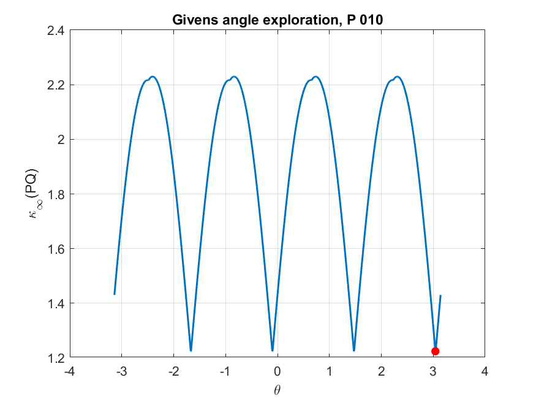
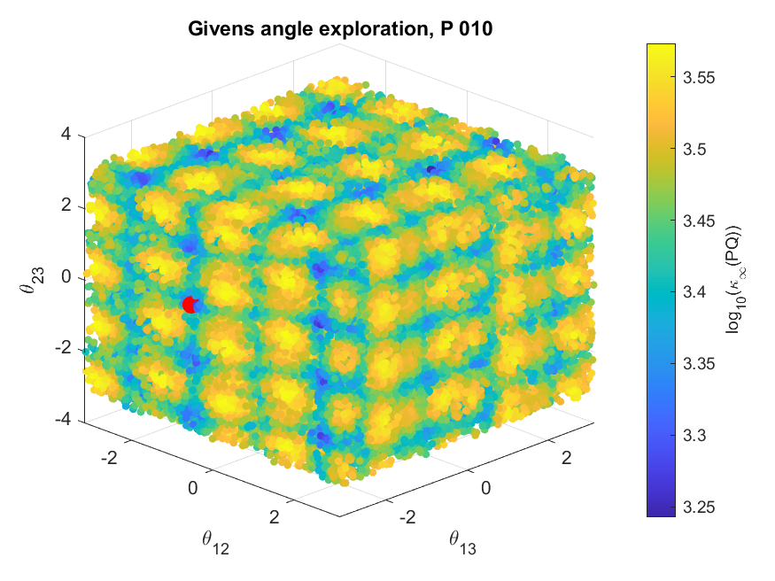
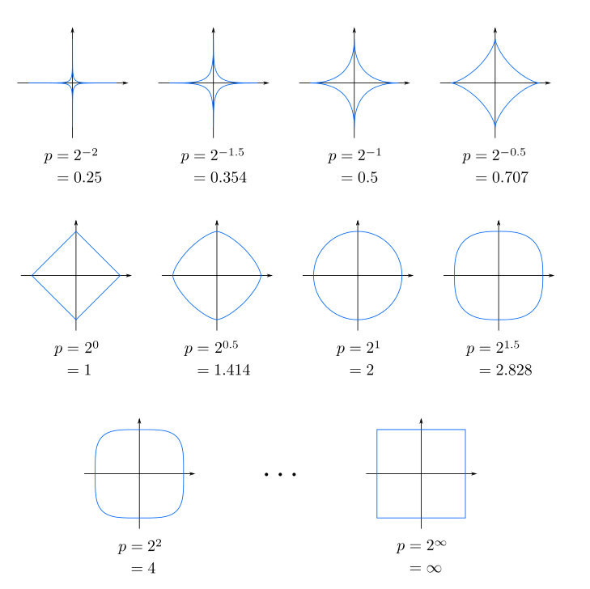

# Objective

The objective of this document is to develop ideas for algorithms related to optimization problems. The first algorithm considered is a projected gradient and subgradient method for optimization over the space of orthogonal matrices.

# Optimization problem involving orthogonal matrices

The admissible set is defined as

$$
\mathcal{O}(K)
=
\left\{
Q\in\mathbb{R}^{K\times K}
:
Q'Q=QQ'=I
\right\}.
$$

To formulate an optimization problem over the set of orthogonal matrices, a generic factorization of the reduced-form covariance matrix can then be written as

$$
\Sigma_e
=
B_0^{-1}B_0^{-1'}.
=
PQQ'P'
$$

where  $P$ is the Cholesky factor associated with the benchmark recursive identification, and $Q\in\mathcal{O}(K)$ is an orthogonal rotation matrix.

Therefore, orthogonal rotations generate alternative structural decompositions that preserve the reduced-form variance-covariance matrix. This provides the basis for defining an optimization problem over $Q$ to select a structural decomposition according to a minimum condition number of $B_0^{-1}=(PQ)$ criterion.

The optimization problem can be formulated as follows: 

$$
Q^{*}= \text{argmin}_{Q\in\mathcal{O}(K)} \kappa_{p}(PQ),
$${#eq-optimizationProblem}

where $p\in\{1,\infty\}$. The case $p=2$ is excluded because, under the Euclidean norm, $\kappa_2(PQ)=\kappa_2(P)$; hence, the objective function does not depend on $Q$.

# Algorithm Riemman Mainfolds

## Gradient Descent

Gradient descent is based on the idea that, for a differentiable multivariable function $f(\mathbf{x})$, the function decreases most rapidly when we move from a point $\mathbf{a}$ in the direction opposite to its gradient, that is,

$$
-\nabla f(\mathbf{a}).
$$

Therefore, starting from a point $\mathbf{a}_n$, we update it as follows:

$$
\mathbf{a}_{n+1}
=
\mathbf{a}_n
-
\eta \nabla f(\mathbf{a}_n),
$$

where $\eta > 0$ is a sufficiently small step size, also called the learning rate. Subtracting $\eta \nabla f(\mathbf{a}_n)$ means that we are moving against the direction of steepest increase, and therefore toward a local minimum.

Using this idea, we begin with an initial guess $\mathbf{x}_0$ and construct a sequence of points

$$
\mathbf{x}_0, \mathbf{x}_1, \mathbf{x}_2, \ldots
$$

according to the rule

$$
\mathbf{x}_{n+1}
=
\mathbf{x}_n
-
\eta_n \nabla f(\mathbf{x}_n),
\qquad n \geq 0.
$$ {#eq-updatex}

If the learning rates $\eta_n$ are chosen properly, the function values decrease at each iteration:

$$
f(\mathbf{x}_0)
\geq
f(\mathbf{x}_1)
\geq
f(\mathbf{x}_2)
\geq
\cdots.
$$

Thus, the method generates a sequence of points that moves progressively closer to a local minimum. The step size does not have to remain constant; it may change from one iteration to the next.

## Euclidean Gradient

For this particular problem, it is convenient to apply a logarithmic transformation to the objective function $f(Q)$ as follows:
$$
\phi(Q)
=
\log \|PQ\|_p
+
\log \|Q'P^{-1}\|_p,
$$

since $(PQ)^{-1}=Q'P^{-1}$ and the logarithm preserves the minimizer.

By the chain rule, a Euclidean gradient or subgradient is

$$
\nabla \phi(Q) = 
  \frac{\nabla g(Q)}{g(Q)}
  +
  \frac{\nabla h(Q)}{h(Q)},
$$

where $g(Q) = \|PQ\|_p$ and $h(Q) = \|Q'P^{-1}\|_p$.

The procedure for computing a gradient or subgradient of $g$ is described below; the case of $h$ is analogous. First, $\nabla g$ can be computed from the definition of the induced norm. For the $\ell_\infty$ norm, it is defined as

$$
\|PQ\|_\infty = \max_i \left\{\sum_{k=1}^K \left|\sum_{j=1}^K p_{i,j}q_{j,k}\right| \right\}, 
$$
where $p_{i,j}$ and $q_{j,k}$ are the entries of the matrices $P$ and $Q$, respectively.

Then, taking a row $i^\star$ that attains the maximum row sum, the derivative of this row with respect to $q_{m,n}$ is

$$
\frac{\partial}{\partial q_{m,n}}
\left(
\sum_{k=1}^K
\left|
\sum_{j=1}^K p_{i^\star,j}q_{j,k}
\right|
\right)
=
p_{i^\star,m}\operatorname{sign}\left((PQ)_{i^\star,n}\right).
$$

In compact matrix form,

$$
\nabla g(Q) = P'\mathbf{e}_{i^\star}s',
$$

where $\mathbf{e}_{i^\star}$ is column vector with zeros in al entries except in active row $i^{\star}$, $s$ is a column vector such that $s_j = \operatorname{sign}\left((PQ)_{i^\star,j}\right)$.

If more than one row attains the maximum, or if some entries of the active row are zero, the same expression should be interpreted as a subgradient, using admissible signs and **convex combinations** over the active rows.

## Continuous idea

The idea is to first write the algorithm in continuous time and then transform it into a discrete form that can be computed iteratively.

Here, we do not differentiate a fixed matrix $Q$; instead, we consider a smooth curve $Q(t)\in\mathcal{O}(K)$ whose entries depend on the parameter $t$.

First, parametrize the matrix as $Q=Q(t)$ so that its orthogonality property can be exploited as follows:

$$
\dfrac{\mathrm{d}}{\mathrm{d}t}(Q(t)Q(t)') =
\dot Q(t)Q(t)' + Q(t)\dot Q(t)' =
\dfrac{\mathrm{d}}{\mathrm{d}t}I =0.
$$ 

Let $\dot Q(t)=\dfrac{\mathrm{d}}{\mathrm{d}t}Q(t)$. Then, from the previous equation, it follows that
 
$$
Q\dot{Q}'= -\dot{Q}Q'.
$$

Now define

$$
\Omega := \dot{Q}Q'.
$$

Then $\Omega$ is a skew-symmetric matrix, $\Omega=-\Omega'$. Thus, the tangent space at $Q$, consisting of the matrices $\mathbfsf{T}$, is $\mathbffrak{T}_{Q} = \{\mathbfsf{T} = \Omega Q : \Omega = -\Omega'\}$.

Moreover, this gives the differential equation

$$
\dot{Q} = \Omega Q,
$$

whose solution is

$$
Q(t) = \exp(t\Omega) Q_0.
$$
with $\Omega$ **fixed** or constant.

It remains to determine the matrix $\Omega$. Intuitively, to move in the direction of steepest descent, the continuous-time dynamics should satisfy

$$
\dot{Q} = -\nabla_{\text{R}}\phi(Q).
$$

In general, the Euclidean gradient $\nabla \phi(Q)$ is not necessarily tangent to the orthogonal group. For this reason, the Riemannian gradient must be used, keeping only the tangent component of the Euclidean gradient.

To identify the tangent component of $\mathbfcal{G}= \nabla \phi(Q)$, use the decomposition $A = \operatorname{sym}(A)+\operatorname{skew}(A)$^[$\operatorname{sym}(A) = \frac{A+A'}{2}$ and $\operatorname{skew}(A) = \frac{A-A'}{2}$]. Since $Q$ is orthogonal, we can write $\mathbfcal{G}(Q) = (\mathbfcal{G} Q')Q$ and obtain

$$
\mathbfcal{G}= \operatorname{sym}(\mathbfcal{G} Q')Q+ \operatorname{skew}(\mathbfcal{G} Q')Q.
$$

Therefore,

$$
\nabla_{\text{R}}\phi(Q)=\operatorname{skew}(\mathbfcal{G} Q')Q.
$$

If we define $\Omega=\operatorname{skew}(\mathbfcal{G} Q')$, the descent flow is

$$
\dot Q = -\Omega Q,
$$

and, over one step with $\Omega$ fixed. Passing from the continuous formulation to a discrete iterative update gives

$$
Q_\text{new} = \exp(-\alpha \operatorname{skew}(\mathbfcal{G} Q'_{\text{old}})) Q_{\text{old}}.
$$

Here, $\mathbfcal{G}=\nabla\phi(Q_{\text{old}})$ is the Euclidean gradient evaluated at the previous iterate $Q_{\text{old}}$.

# Algorithm Givens Rotation Matrices...

## Rotation Matrices

The special orthogonal group is defined as

$$
SO(K)
=
\left\{
Q\in\mathbb{R}^{K\times K}
:
Q'Q=I,\;
\det(Q)=1
\right\}.
$$

Using Givens rotations, an element of $SO(K)$ can be parameterized as

$$
Q(\boldsymbol{\theta})
=
\prod_{i<j} G_{ij}(\theta_{ij}),
\qquad
Q(\boldsymbol{\theta})\in SO(K),
$$

where

$$
\boldsymbol{\theta}
=
\{\theta_{ij}\}_{1\le i<j\le K}.
$$

The total number of rotation angles is

$$
\frac{K(K-1)}{2}.
$$

Equivalently,

$$
SO(K)
=
\left\{
\prod_{i<j} G_{ij}(\theta_{ij})
:
\theta_{ij}\in\mathbb{R}
\right\},
$$

for a fixed ordering of the Givens rotations.

## Algorithm with Rotation Matrices

The purpose of using Givens rotation matrices is to replace the search over
the full space of orthogonal matrices with a search over a finite vector of
rotation angles. Instead of optimizing directly over the entries of $Q$, the
algorithm optimizes over

$$
\boldsymbol{\theta}
\in
\mathbb{R}^{K(K-1)/2},
$$

and then constructs the orthogonal matrix as $Q(\boldsymbol{\theta})$. This
parameterization reduces the dimensionality of the numerical search and
guarantees that every candidate matrix generated by the algorithm is
orthogonal.

The numerical procedure used to approximate the solution of
@eq-optimizationProblem is as follows:

1. Define the number of Givens angles:

   $$
   n_\theta = \frac{K(K-1)}{2}.
   $$

2. Generate an initial collection of $N$ candidate angle vectors,

   $$
   \Theta
   =
   \left\{
   \boldsymbol{\theta}^{(1)},\ldots,
   \boldsymbol{\theta}^{(N)}
   \right\},
   \qquad
   \boldsymbol{\theta}^{(s)}\in[-\pi,\pi]^{n_\theta}.
   $$

   For $K=2$, this can be done with a one-dimensional grid over
   $[-\pi,\pi]$. For higher dimensions, a full Cartesian grid becomes
   computationally infeasible, because the number of grid points grows
   exponentially with $n_\theta$. Therefore, the algorithm uses a
   space-filling design based on *Latin Hypercube Sampling* to explore the
   angle space more evenly than purely independent random draws.

3. For each candidate vector $\boldsymbol{\theta}^{(s)}$, construct the
   corresponding Givens rotation matrix:

   $$
   Q^{(s)} = Q(\boldsymbol{\theta}^{(s)}).
   $$

4. Evaluate the objective function for each candidate:

   $$
   \kappa_p\left(PQ(\boldsymbol{\theta}^{(s)})\right).
   $$

   This produces $N$ candidate condition numbers.

5. Sort the candidates according to their objective values and select the
   best $M$ angle vectors, that is, the vectors associated with the smallest
   values of

   $$
   \kappa_p\left(PQ(\boldsymbol{\theta})\right).
   $$

6. Starting from each of these $M$ promising angle vectors, perform a local
   refinement step. In the current implementation, this refinement is carried
   out with a constrained nonlinear optimizer over the angle vector
   $\boldsymbol{\theta}$, with bounds

   $$
   -\pi \leq \theta_\ell \leq \pi,
   \qquad
   \ell=1,\ldots,n_\theta.
   $$

7. Compare the refined candidates with the best values obtained during the
   initial exploration. The final numerical solution is the matrix

   $$
   Q^* = Q(\boldsymbol{\theta}^*)
   $$

   associated with the smallest condition number found across both the
   initial exploration and the local refinement steps.

This procedure should be interpreted as a multistart numerical search rather
than a guarantee of global optimality. The objective function is non-convex
and non-smooth under the $\ell_1$ and $\ell_\infty$ induced norms, so different
initial angle vectors may lead to different local solutions.

::: {.callout-warning}
With this algorithm, we are only exploring the space of special orthogonal matrices, $SO(K)$. However, matrices with determinant $-1$ are only reflections of $Q$, so it is not necessary to explore them separately.
:::

## Special Cases $K = 2,3,4$

For low-dimensional cases, particularly $K=2,3,4$, the numerical solutions
often exhibit additional structure. In these cases, the matrices $Q^*$ found
by the algorithm can frequently be grouped into families of equivalent or
nearly equivalent rotations. Within each family, different solutions appear to
be related by canonical angular shifts, such as

$$
\pm \pi,\qquad
\pm\frac{\pi}{2},\qquad
\pm\frac{2\pi}{3}.
$$

This suggests that, in small dimensions, the optimizer may recover several
representations of the same underlying rotation pattern. These patterns are
easier to identify when the Givens angles are compared modulo canonical angle
increments, or when the resulting matrices are compared up to signed
permutations.

::: {layout-ncol=2}

:::

For higher-dimensional cases, especially when $K>4$, the same type of simple
structure is not as clearly observed numerically. The number of Givens angles
increases rapidly with $K$, and the optimization landscape becomes more
complex. As a result, different local solutions for the same matrix $P$ may no
longer be easily described by a small set of canonical angular rotations.

It is also important to account for symmetries induced by the objective
function. Under the induced infinity norm, column permutations and sign changes
of $Q^*$ preserve the row-wise absolute sums of $PQ^*$. Therefore, if $Q^*$ is
a solution, then

$$
Q^*S
$$

is also an equivalent solution for any signed permutation matrix $S$. A signed
permutation matrix combines a permutation of the columns with independent sign
changes. Since there are $K!$ possible permutations and $2^K$ possible sign
patterns, each solution generates an equivalence class containing

$$
2^K K!
$$

matrices with the same objective value. This symmetry should be considered
when counting or comparing numerical solutions, since apparently distinct
matrices may represent the same solution up to signed permutation.

# Large-K Haar-Riemannian-Givens Algorithm

The algorithm first fixes a reproducible covariance matrix $\Sigma_e$, computes
its Cholesky factor $P$, sets the optimization options, and then runs several
independent searches with different random seeds. These independent runs are
used because each one starts from a different random exploration of
$\mathcal{O}(K)$, which helps the algorithm search different regions of a
non-convex objective. After all runs are completed, it compares the resulting
values of $\kappa_p(PQ)$ and selects the best rotation found across the
experiment.

Each batch of runs follows a three-stage search strategy.

1. It explores $\mathcal{O}(K)$ by evaluating the identity matrix and many
random orthogonal matrices drawn from the Haar distribution.

2. It keeps the best elite candidates from the Haar exploration and uses them
as starting points for a smooth Riemannian descent step on the orthogonal
manifold. This stage exploits the local geometry of $\mathcal{O}(K)$: each
update moves along directions that preserve orthogonality, so the refinement
can reduce the objective without leaving the feasible set.

3. It polishes each refined solution using exact Givens rotations. This final
stage updates pairs of columns through plane rotations and accepts the changes
that reduce the condition number under the chosen norm. The Givens sweep is a
local coordinate-wise improvement step, so it is useful for correcting small
suboptimalities that may remain after the Riemannian refinement. Mathematically,
for each pair of columns $(i,j)$ the algorithm considers a local update of the
form

$$
Q_{\text{new}} = Q G_{ij}(\delta),
$$

where $G_{ij}(\delta)$ is the identity matrix except for a two-dimensional
rotation in the $(i,j)$ plane. The angle is chosen by solving the one-dimensional
problem

$$
\delta_{ij}^*
=
\arg\min_{\theta}
\kappa_p\left(PQG_{ij}(\delta)\right),
$$

and the update is accepted whenever

$$
\kappa_p\left(PQG_{ij}(\delta_{ij}^*)\right)
<
\kappa_p(PQ).
$$

Thus, the Givens polishing step can be interpreted as applying small structured
perturbations across the coordinate planes of the current orthogonal matrix.

The output of the optimizer includes the selected matrix $Q^*$, the rotated
structural factor $PQ^*$, the best condition number $\kappa_p(PQ^*)$, and
diagnostics such as the improvement relative to the Cholesky benchmark,
$\|Q^{*'}Q^*-I\|_F$, $\det(Q^*)$, and the direct objective error. The global
script stores these outputs for all seeds, chooses the run with the smallest
condition number, and saves the complete experiment for later analysis.

## Experiment

For $K=25$, the experiment was run with $500$ independent random seeds,
starting from seed $1$ and using consecutive seeds across runs. In each run,
the algorithm evaluated $10000$ Haar draws, kept the best $100$ elite
candidates, allowed up to $100$ Riemannian refinement iterations and $10$
Givens polishing sweeps.

- The best value found was $\kappa\star=43.4725459286549$, while the worst
value among the stored solutions was $47.8204363834455$, giving a range of about $4.348$.
- The average value was $46.2702147729366$, with a standard deviation of $0.7205$,
indicating that most runs reached broadly similar but not identical objective values.
- Using a tolerance of $10^{-4}$, the 500 solutions were separated into 494
distinct $\kappa\star$ groups, so grouping only by the numerical objective
value does not reveal a small number of repeated solutions.

## Scaling vrs Rotation

For diagonal scalings, Bauer (1963) showed that, in the maximum norm, an optimal scaling can be characterized by the equality of the relevant absolute row sums. 

$$
\min_{D > 0 \text{ diagonal}} \kappa_\infty(AD) = \big\|\,|A||A^{-1}|\big\|_\infty ,
$$

attained when the rows of $AD$ are equilibrated, $|D^{-1}A|\,e = e$.

This suggests asking whether orthogonal transformations produce an analogous balancing phenomenon:

 **Optimality.** Do minimizers of $\kappa_\infty(PQ)$ balance the row sums, fully or partially?

Proposition  answers the second only partially, and in a way that departs from Bauer's picture.

## Proposition 1

Let $P \in \mathbb{R}^{K\times K}$ be nonsingular, let $\kappa(Q) = \kappa_\infty(PQ)$, and let

$$
I(Q) = \arg\max_i \, u_i(Q), \qquad J(Q) = \arg\max_j \, v_j(Q)
$$

be the sets of dominant rows of $PQ$ and of $(PQ)^{-1} = Q^\top P^{-1}$, respectively.

Let $Q^*$ be a **local** minimizer of $\kappa$ on $O(K)$ (in particular, any global minimizer). Then at least one of the following holds:

1. **(Zero in the direct factor.)** $I(Q^*) = \{i\}$ is a singleton and the dominant row $e_i^\top P Q^*$ has at least one zero entry.
2. **(Zero in the inverse factor.)** $J(Q^*) = \{j\}$ is a singleton and the dominant row $e_j^\top Q^{*\top} P^{-1}$ has at least one zero entry.
3. **(Tie in the direct factor.)** $|I(Q^*)| \ge 2$: two or more rows of $PQ^*$ attain $\|PQ^*\|_\infty$.
4. **(Tie in the inverse factor.)** $|J(Q^*)| \ge 2$: two or more rows of $Q^{*\top}P^{-1}$ attain $\|Q^{*\top}P^{-1}\|_\infty$.

Equivalently, let $R \subset O(K)$ be the set of $Q

## Remarks

**Necessary, not sufficient.** The theorem restricts *where* minimizers can be. Points satisfying 1–4 are candidates; many of them are not minimizers.

**Only dominant rows matter.** Zeros in non-dominant rows, and ties among non-dominant rows, play no role.

**Interpretation of conditions 1–2.** Row $i$ of $PQ$ has fixed Euclidean norm $\|p_i\|_2$, and $\|w\|_1 \ge \|w\|_2$ with equality iff $w$ has a single nonzero entry. Zeros in the dominant row therefore reduce its absolute row sum. In terms of the columns $q_m$ of $Q$:

$$
(PQ)_{im} = 0 \iff q_m \perp p_i, \qquad (Q^\top P^{-1})_{jm} = 0 \iff q_j \perp P^{-1} e_m .
$$

**The case $K = 2$.** Every $Q \in O(2)$ is $Q(\theta)$ or $Q(\theta)\operatorname{diag}(1,-1)$, where $Q(\theta)$ is the rotation by $\theta$. Since $\operatorname{diag}(1,-1)$ and $Q(\pi/2)$ are signed permutations, it suffices to take $\theta \in [0, \pi/2)$. Each entry of $A$ and $B$ has the form $a\cos\theta + b\sin\theta$, and on each interval with fixed signs, each condition 1–4 reduces to an equation of the same form. Barring degenerate cases in which such an expression vanishes identically, the candidate set is therefore finite and explicit, and the global minimum is the smallest value of $\kappa$ on it. 

# Appendix {#sec-appendix .appendix}

## Intuition of norms

To understand the induced $p$-norm, we must first remember that changing the value of $p$ completely changes what we regard as a “unit sphere”—the set of vectors whose length equals 1:

* **If $p=2$ (Euclidean norm):** The unit sphere is a perfectly **round ball**. We measure distance in a straight line.
* **If $p=1$ (taxicab norm):** The unit sphere becomes a **diamond or rhombus**. Distances are measured by turning corners, as on city streets.
* **If $p=\infty$ (maximum norm):** The unit sphere is a **square or cube**. Only the largest coordinate matters.

### The Induced $p$-Norm:

1. Take the “sphere” corresponding to that particular $p$ (a diamond for $p=1$, a circumference for $p=2$, or a square for $p=\infty$).
2. Let the matrix $A$ transform and deform that shape.
3. The induced $p$-norm is the farthest point of the resulting transformed figure, measured according to the rules of that same $p$-norm.

{#fig-norms width="50%"}

## Proof of proposition 

## Proof

### Step 1: Local product representation on $R$

Let $Q_0 \in R$. Then $I(Q_0) = \{i\}$, $J(Q_0) = \{j\}$, and all entries of the dominant rows $e_i^\top P Q_0$ and $e_j^\top Q_0^\top P^{-1}$ are nonzero. Let

$$
\sigma = \operatorname{sign}\!\big(Q_0^\top p_i\big) \in \{\pm1\}^K, \qquad \tau = \operatorname{sign}\!\big(P^{-\top} Q_0 e_j\big) \in \{\pm1\}^K
$$

be the sign vectors of these two rows. All entries of $A(Q)$ and $B(Q)$ depend continuously on $Q$, and every defining condition of $R$ is a strict inequality ($u_i > u_k$ for $k \ne i$, $v_j > v_k$ for $k \ne j$, and each entry of the two dominant rows nonzero). Hence there is an open neighbourhood $U \subset R$ of $Q_0$ on which the dominant rows remain $i$ and $j$ and their sign vectors remain $\sigma$ and $\tau$. On $U$:

$$
\|A(Q)\|_\infty = u_i(Q) = p_i^\top Q\,\sigma, \qquad
\|B(Q)\|_\infty = v_j(Q) = e_j^\top Q^\top P^{-1}\tau = (P^{-1}\tau)^\top Q\, e_j .
$$

Setting $x_1 = p_i$, $y_1 = \sigma$, $x_2 = P^{-1}\tau$, $y_2 = e_j$ (all nonzero), we obtain on $U$

$$
\kappa(Q) = \ell_1(Q)\,\ell_2(Q), \qquad \ell_k(Q) = x_k^\top Q\, y_k > 0 .
$$

### Step 2: Derivatives along one-parameter subgroups

For $S^\top = -S$ consider the curve $t \mapsto Q_0 e^{tS} \in O(K)$. With $a_k = Q_0^\top x_k$,

$$
\frac{d}{dt}\,\ell_k(Q_0 e^{tS})\Big|_{t=0} = a_k^\top S\, y_k = \langle S,\ a_k y_k^\top\rangle = \langle S,\ \operatorname{skew}(a_k y_k^\top)\rangle,
$$

where the last equality holds because a skew-symmetric matrix is Frobenius-orthogonal to every symmetric matrix.

**Lemma.** For nonzero $a, y \in \mathbb{R}^K$, $\operatorname{skew}(a y^\top) = 0$ if and only if $a$ and $y$ are parallel. Otherwise $\operatorname{skew}(a y^\top)$ has rank $2$ and range $\operatorname{span}(a, y)$.

*Proof.* $(a y^\top - y a^\top)v = (y^\top v)\,a - (a^\top v)\,y$, so the range lies in $\operatorname{span}(a,y)$, and the matrix vanishes when $a \parallel y$. If $a, y$ are independent, choose $v \perp a$ with $y^\top v \ne 0$ to obtain a nonzero multiple of $a$ in the range, and $v \perp y$ with $a^\top v \ne 0$ to obtain a nonzero multiple of $y$. Hence the range is all of $\operatorname{span}(a,y)$. $\square$

### Step 3: A local minimizer in $R$ would be a critical point

Suppose, for contradiction, that $Q_0 \in R$ is a local minimizer of $\kappa$. On $U$ the function $g = \log \ell_1 + \log \ell_2 = \log\kappa$ is smooth and also has a local minimum at $Q_0$. Hence its derivative along every curve $Q_0 e^{tS}$ vanishes:

$$
\langle S, W\rangle = 0 \ \ \forall\, S \in \mathfrak{so}(K), \qquad
W = \frac{\operatorname{skew}(a_1 y_1^\top)}{\ell_1(Q_0)} + \frac{\operatorname{skew}(a_2 y_2^\top)}{\ell_2(Q_0)} .
$$

Since $W$ is itself skew-symmetric, taking $S = W$ gives $W = 0$. Hence either both skew parts vanish (Case A) or both are nonzero and negatively proportional (Case B).

### Step 4, Case A: both skew parts vanish

By the Lemma, $a_1 \parallel y_1$ and $a_2 \parallel y_2$. Since $\ell_k(Q_0) = a_k^\top y_k > 0$ and $\|a_k\| = \|x_k\|$, we get $\ell_k(Q_0) = \|x_k\|\,\|y_k\|$, which by Cauchy–Schwarz is the maximum of $\ell_k$ over $O(K)$.

Let $\hat y = y_1/\|y_1\|$, pick a unit vector $w \perp \hat y$ (possible since $K \ge 2$), and set $S = \hat y w^\top - w \hat y^\top$. Then $S\hat y = -w$ and $Sw = \hat y$, so $e^{tS}\hat y = \cos t\,\hat y - \sin t\, w$. Because $a_1 \parallel \hat y$ and $a_1 \perp w$,

$$
\ell_1(Q_0 e^{tS}) = \|y_1\|\, a_1^\top(\cos t\,\hat y - \sin t\, w) = \|x_1\|\,\|y_1\| \cos t < \ell_1(Q_0) \quad (0<|t|<\pi/2).
$$

Also $0 < \ell_2(Q_0 e^{tS}) \le \ell_2(Q_0)$ for small $|t|$. Hence $\kappa(Q_0 e^{tS}) < \kappa(Q_0)$ for all small $t \neq 0$, with $Q_0 e^{tS} \in U$. This contradicts local minimality.

### Step 5, Case B: both skew parts are nonzero

From $W = 0$ we have $\operatorname{skew}(a_1 y_1^\top) = -\tfrac{\ell_1}{\ell_2}\operatorname{skew}(a_2 y_2^\top)$. By the Lemma both have rank $2$ with equal ranges:

$$
\Pi := \operatorname{span}(a_1, y_1) = \operatorname{span}(a_2, y_2), \qquad \dim \Pi = 2 .
$$

Let $\{b_1, b_2\}$ be an orthonormal basis of $\Pi$ and $S = b_2 b_1^\top - b_1 b_2^\top$. Then $e^{tS}$ rotates $\Pi$ by angle $t$ and fixes $\Pi^\perp$. Since $a_k, y_k \in \Pi$,

$$
\ell_k(Q_0 e^{tS}) = a_k^\top e^{tS} y_k = \|x_k\|\,\|y_k\|\cos(t + \varphi_k),
\qquad \cos\varphi_k = \frac{\ell_k(Q_0)}{\|x_k\|\,\|y_k\|} > 0 .
$$

Define $h(t) = \log \kappa(Q_0 e^{tS}) = \text{const} + \log\cos(t+\varphi_1) + \log\cos(t+\varphi_2)$ for small $|t|$. By Step 3, $h'(0) = \langle S, W\rangle = 0$, and

$$
h''(0) = -\sec^2\varphi_1 - \sec^2\varphi_2 < 0 .
$$

So $t = 0$ is a strict local maximum of $h$: $\kappa(Q_0 e^{tS}) < \kappa(Q_0)$ for small $t \ne 0$, with $Q_0 e^{tS} \in U$. This again contradicts local minimality.

### Step 6: Conclusion

Both cases are impossible, so no point of $R$ is a local minimizer of $\kappa$. Any local minimizer, and in particular any global minimizer, lies in $O(K) \setminus R$, i.e. satisfies at least one of conditions 1–4. $\blacksquare$

